# Prevent Awareness

Prevent Awareness is a site that hopes to inform the public of what the Prevent program is, and how it aims to counter radicalization and extremism. The site will be targeted to both people who might know an extremist, and people who fear that they themselves are being radicalized. The site aims to provide clear and accurate information with additional resources, and community engagement.

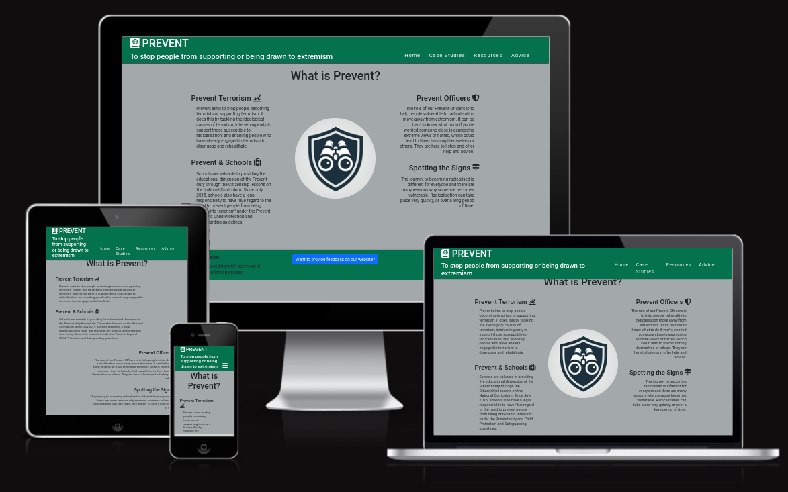

## Index – Table of Contents
* [User Experience (UX)](#user-experience-ux) 
* [Features](#features)
* [Design](#design)
* [Technologies Used](#technologies-used)
* [Testing](#testing)
* [Deployment](#deployment)
* [Credits](#credits)

## User Experience (UX)

-   ### User stories

    -   #### Homepage:
        1. In order to **learn about the Principles of prevent** as a **user**, I can **go to the principles section on the homepage**
        2. In order to **learn about the objectives of prevent** as a **user**, I can **go to the objectives section on the homepage**
        3. In order to **understand what website I am on** as a **user**, I can **see the welcome message/title on the homepage**
        4. In order to **understand how prevent operates within the wider context of counter-terrorism** as a **user**, I can **go to the section on the homepage**

    -   #### Navigation:
        1. In order to Menu - links to each page as a **user*, I can **click in each page on navigation bar**
        2. In order to **links to sections** as a **user*, I can **click on each section in navigation bar**
	
    -   #### Footer:
        1. In order to **in alignment with legal requirement on copyright** as a **website owner**, I can **post disclaimer information visible to all users**
        2. In order to **check if anything relating to copyright issues** as a **user**, I can **have visibility of the disclaimer information**
        3. In order to **add interaction with user** as a **website owner**, I can **collect user’ feedback on their experiences of the website**
        4. In order to **interact with the website** as a **user**, I can **give feedback of the website exploring experience**
        5. In order to **access related social media  links** as a **user**, I can **quickly connect to the social media platforms**
        6. In order to *access external links to workshops** as a **user**, I can **quickly connect to the further related workshops**

    -   #### Case studies:
        1. In order to **learn about Local examples** as a **user**, I can **find the section on the case studies page**
        2. In order to **learn about national examples** as a **user**, I can **find the section on the case studies page**
        3. In order to **learn about community initiatives** as a **user**, I can **find the section on the resources page and  follow links to their websites**

    -   #### Resources:
        1. In order to ** watch you-tube -videos** as a **user**, I can **click on videos in resources**
        2. In order to **see  profile picture of reformed extremist* as a *user*, I can **click on profile picture in resources**
        3. In order to **embedded Iframes ** as a **user** , I can  adds the content of the new page while keeping the content of the current document unchanged**

    -   #### Advice:
        1. In order to **contact authorities if required** as a **user**, I can **have access to contact authorities**
        2. In order to **contact for further advice/help** as a **user**, I can **leave the contact details for further correspondences**
        3. In order to **get advice on how to talk to potential extremist friend** as a **user**, I can **get related advice on this topic**

     
## Features 

### Existing Features

- __Navigation Bar__

  - Featured on all three pages, the full responsive navigation bar includes links to the Home page, Case Studies, Resources, and Advice page and is identical in each page to allow for easy navigation.
  - This section will allow the user to easily navigate from page to page across all devices without having to revert back to the previous page via the ‘back’ button. 

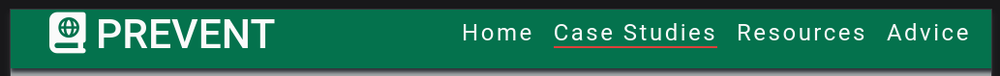

- __Principles and Objectives Section__

  - On the landing page the first thing the user can see is a summary of what Prevent aims to do, how schools are involved, the role of prevent officers, and how to spot the signs of radicalisation.
  - The user will see the value prevent and will hopefully want to learn more on the other web pages.

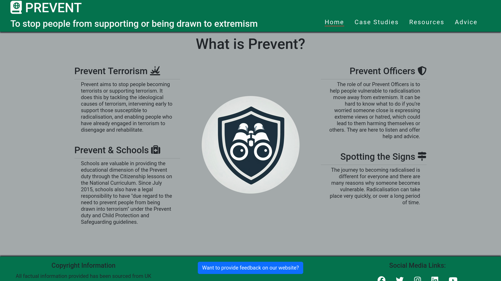

- __The Footer__ 

  - The footer section includes copyright disclaimer information, a button to a feedback modal form, and social media links to counter terrorism police UK.
  - The footer is valuable to the user as it encourages them to keep connected via social media, provide us with feedback, and informs any concerned parties of our sources of information.

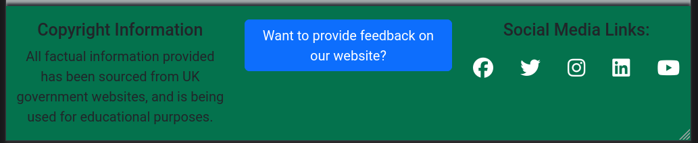

- __Feedback Modal__ 

  - The feedback button found in the footer, opens up a modal which has an email field, textbox area, close and send buttons.
  - This allows the user to send any feedback they want to about the website, increasing their engagement.

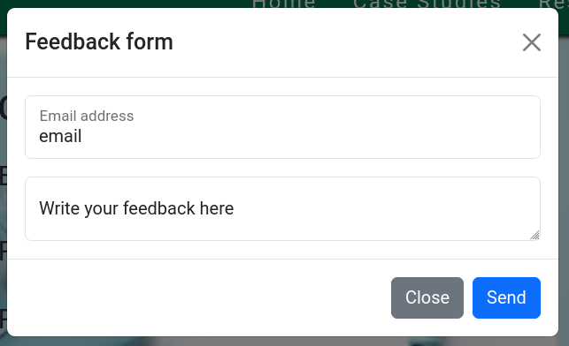

- __Resources Page__

  - The resources page will provide the user with motivational images relating to the elements of Prevent; as well as embed youtube videos from related organizations.
  - This page is useful to the user as it condenses factual information into easily digestible segments.

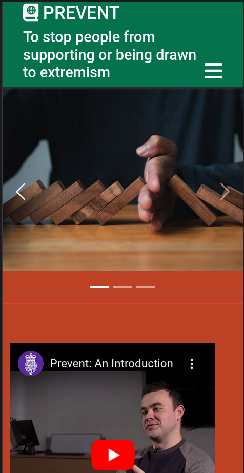

- __Advice Page__

  - This page allows the user to find the appropriate authorities to contact about their concerns.
  - Alternatively they can provide their contact information if they wish to be contacted. They also have the option to specify their preferred means of contact.
  - This page is useful to the user as after viewing the other pages, they may recognise symptons of radicalisation in a friend/themself, and need advice on what to do.

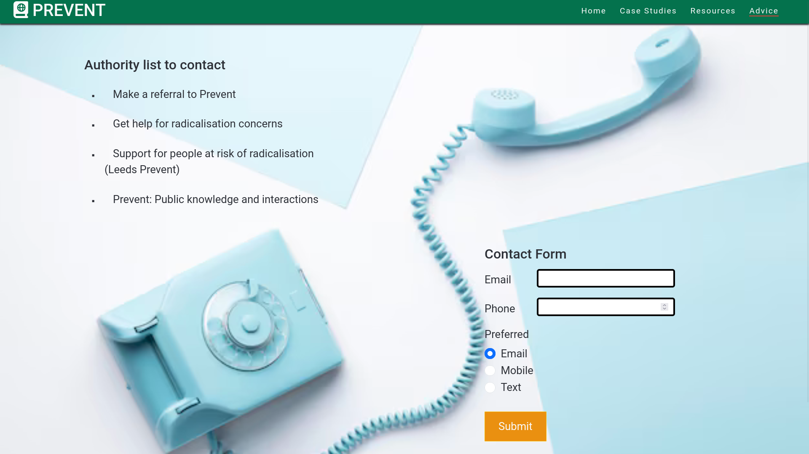

- __Case Studies Page__

  - The case studies page will provide the user examples of how Prevent has stepped in, and deradicalised people before they put themselves or others to harm.
  - This page is useful to the user as it puts faces to the issue of extremism and shows how things can be turned around. This personifies the issues the site is trying to convey.

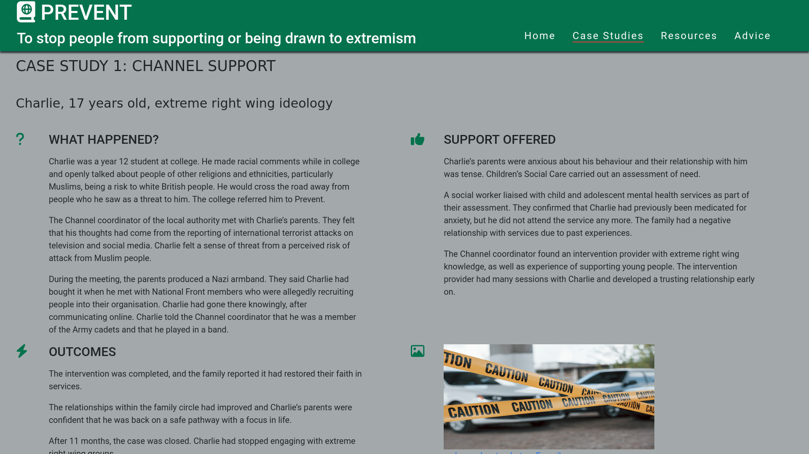

### Features Left to Implement

- Resources: external links to other organizations prevent workshops
	- It would be helpful to allow users to find other useful workshops about prevent such as online courses.
- Advice section: how to talk to your potential extremist friend
	- Not every case needs police intervention. Before contacting the police it is important to assess how extreme your friend is. It may also be possible to help deradicalise them if you have the correct approach. This section would attempt to answer these issues.
- Links to sections within the page
	- If we get to a point where our website involves a lot of scrolling, it may be worthwhile adding internal links to segments of the page.
- Resources: community initiatives
	- If after viewing our website a user would like to help stop extremism, we would include links to respectable community initiatives that band together to do just that.
  
## Design

-   ### Colour Scheme
    -  We agreed that a couple dark colours mixed with bright colours would work for our website. Including red was important to convey the danger of terrorism. The colours picked were generated the website [Coolors](https://coolors.co/)

        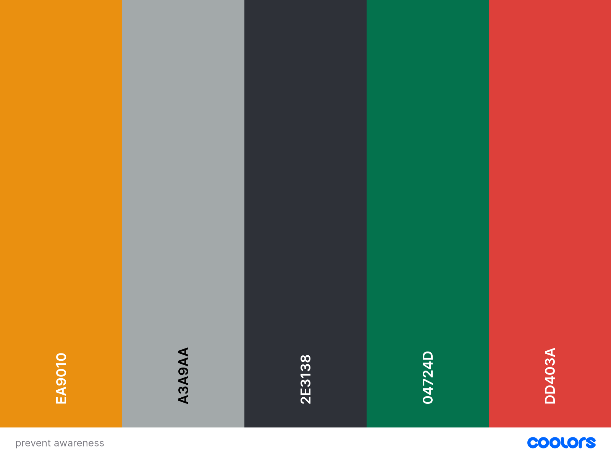

-   ### Typography
    - Google Fonts were used to import Roboto condensed and Roboto fonts into styles.css.  These were chosen as they incorporate a lot of straight thick lines which comes across as oppressive. The fonts were tested for their effectiveness by how they made the word 'terrorism' look.
 
    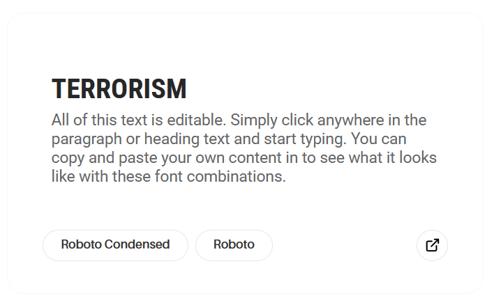   

-   ### Logo/Icon
    - The logo design incorporates a shield and binoculars. The shield because Prevent seeks to protect, and binoculars because Prevent needs to look closely to spot signs of radicalisation. The logo was generated using [bing copilot designer](https://www.bing.com/chat?q=Microsoft+Copilot&FORM=hpcodx)
 
	

-   ### Wireframes

    -   #### Khadeeja Wireframes

        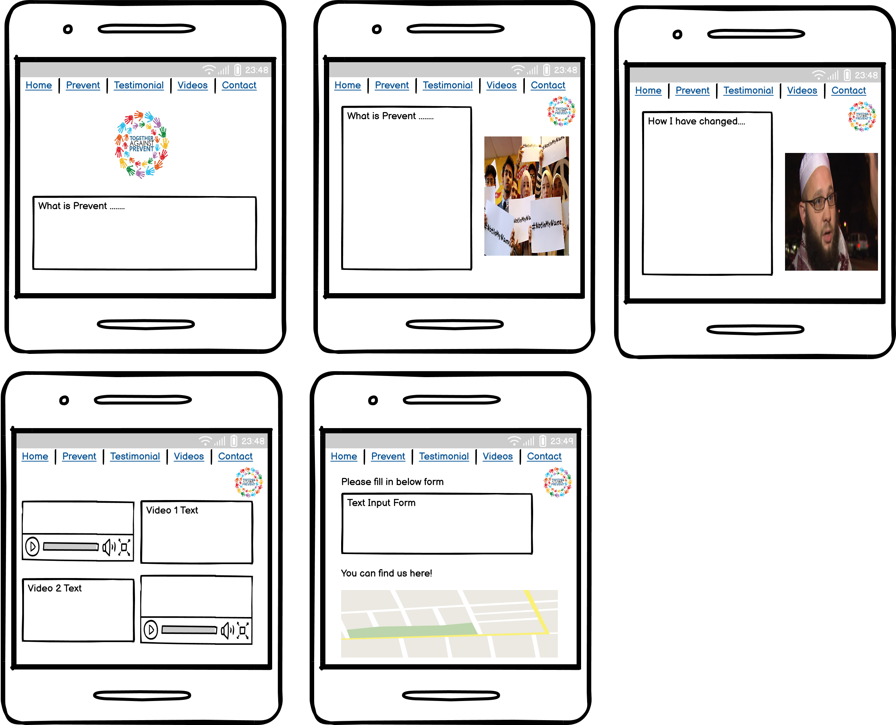

    -   #### Yu homepage and case studies Wireframes

        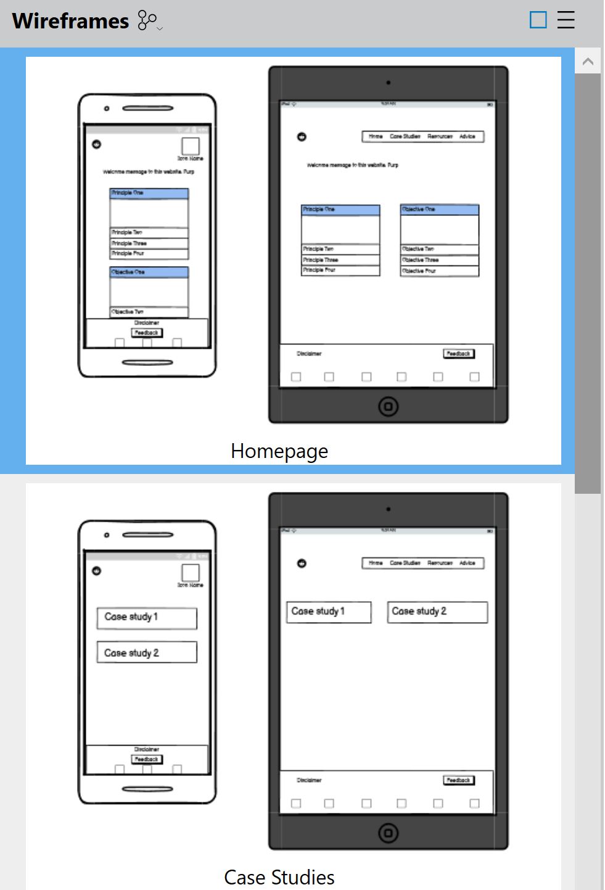

    -   #### Yu resources and advice Wireframes

        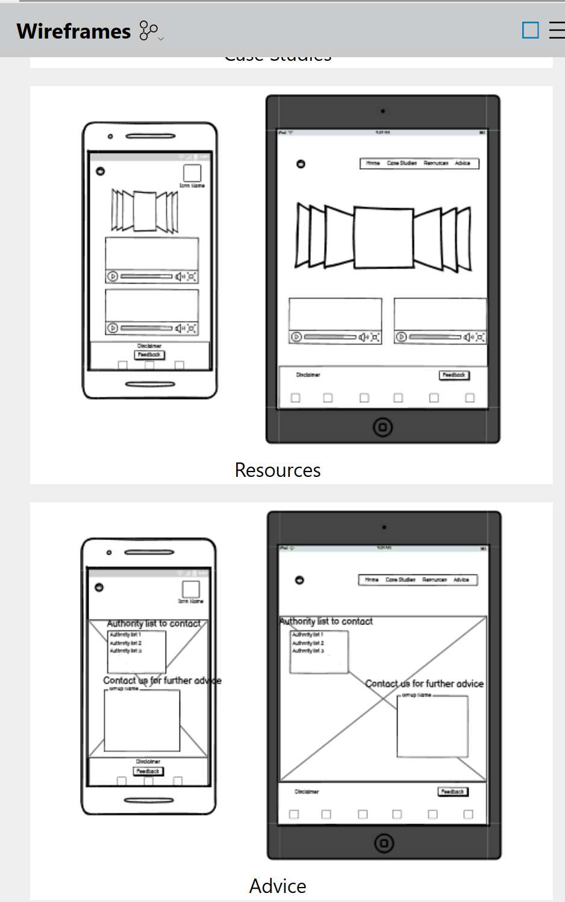

## Technologies Used

### Languages Used

-   [HTML5](https://en.wikipedia.org/wiki/HTML5)
-   [CSS3](https://en.wikipedia.org/wiki/Cascading_Style_Sheets)

### Frameworks, Libraries & Programs Used

-   [Google Fonts:](https://fonts.google.com/) was used to import the 'Roboto Condensed' and 'Roboto' fonts into the style.css file which are used on all pages of the project.
-   [Font Awesome:](https://fontawesome.com/) was used to add icons for aesthetic and UX purposes.
-   [Git:](https://git-scm.com/) was used for version control by utilising the Gitpod terminal to commit to Git and Push to GitHub.
-   [GitHub:](https://github.com/) is used as the respository for the projects code after being pushed from Git.
-   [Balsamiq:](https://balsamiq.com/) was used to create the wireframes during the design process.
-   [bootstrap 5.3:](https://getbootstrap.com/) was the framework used to streamline styling classes.
-   [favicon:](https://favicon.io/) was used for creating website logo icons.
    

## Testing 

### Validator Testing 

- HTML
  - 4 errors were returned when passing through the official [W3C validator]([https://validator.w3.org/nu/?doc=https%3A%2F%2Fcode-institute-org.github.io%2Flove-running-2.0%2Findex.html](https://validator.w3.org/nu/?doc=https%3A%2F%2Fmarkchips.github.io%2Fprevent-awareness%2Findex.html))
- CSS
  - 1 error was found when passing through the official [(Jigsaw) validator](https://jigsaw.w3.org/css-validator/validator?uri=https%3A%2F%2Fmarkchips.github.io%2Fprevent-awareness%2Findex.html&profile=css3svg&usermedium=all&warning=1&vextwarning=&lang=en)

### Unfixed Bugs

- Page content keeps disappearing behind header on some screen sizes. This relates to the header being position: fixed. The content needs the margin to be adjusted.

## Deployment

- The site was deployed to GitHub pages. The steps to deploy are as follows: 
  - In the GitHub repository, navigate to the Settings tab
  - Click pages on the left side
  - In the branch section, use the drop down menu to select the main branch
  - Click save, and then wait for the deployment to be generated
  - Click visit site button at top of settings

The live link can be found here - https://markchips.github.io/prevent-awareness/index.html

## Credits 

### Content 

- The following UK government web pages were used for all factual information:
	- Case Study: https://www.gov.uk/government/publications/the-prevent-duty-safeguarding-learners-vulnerable-to-radicalisation/case-studies
 	- Prevent Officers on Home Page: https://www.met.police.uk/advice/advice-and-information/t/prevent/prevent/
  	- Prevent Terrorism on Homepage: https://www.gov.uk/government/publications/independent-review-of-prevents-report-a[…]endent-review-of-prevent-one-year-on-progress-report-accessible
  	- Prevent School on HomePage: https://www.teachingcitizenship.org.uk/wp-content/uploads/2022/08/ACT_Prevent-and-controversial-issues-guidance_guide-1.pdf
  	- Prevent Spotting the Signs: https://www.met.police.uk/advice/advice-and-information/t/prevent/prevent/
- The icons in the footer were taken from [Font Awesome](https://fontawesome.com/)

### Media

- The icons were taken from [Font Awesome](https://fontawesome.com/)
- The fonts used were imported from [Google Fonts](https://fonts.google.com/)

- Images were sourced from www.freepik.com, and taken from the following web pages:
	- https://www.freepik.com/free-photo/black-white-vehicles-yellow-caution-tape-near-car-parking-lot-daytime-crime-scene_9818237.htm#fromView=search&page=1&position=34&uuid=69e5363c-95dc-4b74-96a1-cda464b3fd90
	- https://www.freepik.com/free-vector/crime-scene-with-tape-concept-illustration_37573771.htm#fromView=search&page=1&position=7&uuid=f659683b-489f-444b-8ce9-267a93dde8c1
	- https://www.freepik.com/free-photo/wedding-bouquet-rocks_3402602.htm#fromView=search&page=1&position=0&uuid=c9b5bc51-2d3c-4268-9e6b-5040e2925bb5
	- https://www.freepik.com/free-ai-image/diverse-people-addicted-their-smart-devices-scrolling-through-looking-into-their-screens_186027476.htm#fromView=search&page=1&position=17&uuid=8515378b-b6bf-4255-95f5-2a4a3e313bdc
	- https://www.freepik.com/free-photo/top-view-blue-monday-concept-composition-with-telephone_19534931.htm

